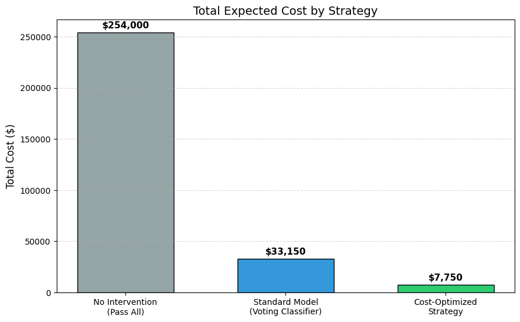
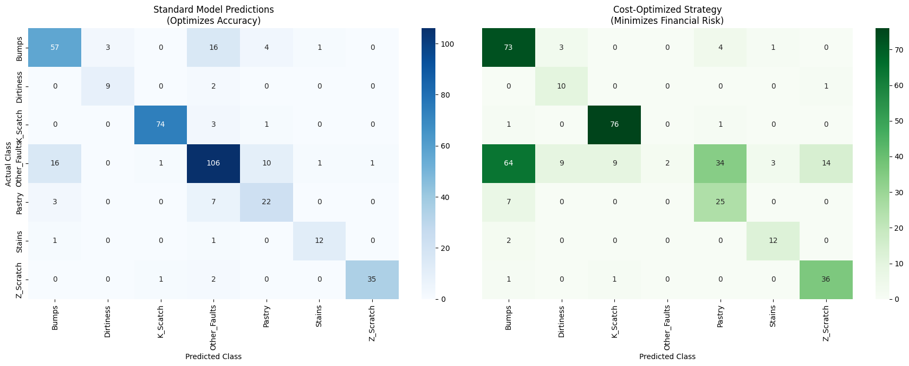

# Steel Plate Surface Fault Detection & Cost-Benefit Analysis

**Bridging the gap between pure ML metrics and real-world business costs.**

This project uses machine learning techniques to perform multi-class fault detection on the UCI Steel Plates Faults dataset. Beyond standard classification, it introduces a **Cost-Sensitive Learning strategy** to evaluate and optimize model decisions from an economic perspective.

---

## Why I Built This

In a data science competition, 99% accuracy is gold. But on a factory floor, if that 1% error is a critical defect sent to a client, it's a disaster.

> **The Conflict:**
> * **Data Scientists shout:** "Maximize Accuracy!"
> * **Factory Managers shout:** "Don't ship bad parts!"

My goal was simple: Train a solid model first, and then force it to respect the financial reality of a steel mill—where **missing a defect costs a fortune ($1,000)**, but a **false alarm is just a cheap nuisance ($50)**.

---

## Technical Approach

### 1. Automated Data Pipeline
* **Acquisition:** Automatic download and extraction of data from the UCI repository.
* **Preprocessing:** Data cleaning and removal of Collinear Features.
* **Transformation:** Standardization and Label Encoding.

### 2. Strong Ensemble Model
I utilize a **Soft Voting Classifier** to integrate three distinct models:

| Model | Weight | Role |
| :--- | :---: | :--- |
| **LightGBM** | **3** | Provides raw predictive power. |
| **Random Forest** | **2** | Acts as a safety net to prevent overfitting. |
| **Logistic Regression** | **1** | Stabilizes predictions. |

**Why this setup?**
Single models can be volatile. By combining LightGBM with Random Forest and Logistic Regression, the ensemble captures complex patterns while "smoothing out" specific noise, resulting in a robust predictor.

### 3. Deep Cost-Benefit Analysis
Instead of simply choosing the class with the highest probability, the model calculates the **expected financial risk** for each class and selects the decision with the lowest risk.

#### Custom Cost Matrix

| Scenario | Penalty | Description |
| :--- | :---: | :--- |
| **Missed Detection** | **$1,000** | Fault misclassified as `Other_Faults` (Customer complaints). |
| **False Alarm** | **$50** | `Other_Faults` misclassified as Fault (Manual review cost). |
| **Misclassification** | **$50** | Confusion between fault types (Internal review cost only). |

---

## Output Results

Running the program generates the following analysis charts:

### 1. Financial Impact Analysis
`cost_comparison.png`

* **No Intervention:** Baseline cost of passing all plates.
* **Standard Model:** Optimized only for accuracy.
* **Cost-Optimized:** Optimized based on the financial matrix above.

### 2. Decision Adjustment Visualization
`dual_confusion_matrix.png`

* **Left Chart:** Standard model prediction distribution.
* **Right Chart:** Shows how the model becomes more conservative (drastically reducing missed detections) after introducing high penalties.

### 3. Key Metrics Log
The output logs provide a comparison of trade-offs:
* **Accuracy:** The cost-optimized model may sacrifice some accuracy for lower financial risk.
* **Review Rate:** The proportion of samples flagged for manual review.
* **Total Savings:** The expected amount saved compared to the "No Intervention" strategy.

---

## Further Thinking

### "Hidden Costs" (Operational Impact)
The shift in model logic reveals the true cost of quality assurance:

* **Standard Model Review Rate (e.g., 64.78%):**
    The baseline workload when solely pursuing accuracy. For every 10,000 plates, humans inspect ~6,478.
* **Optimized Model Review Rate (e.g., 99.49%):**
    To avoid the $1,000 penalty for missed detections, the model almost always calls for a review. This indicator honestly reflects the **significant increase in worker workload**, a critical factor for management.

### Auto-Release Volume
* **Example:** `2` (Only 2 out of 389 samples were auto-released/classified as 'Other_Faults').

This serves as intuitive proof of the model's new logic:
> **"Better to tolerate high False Positives (FPs) than risk a single False Negative (FN)."**
